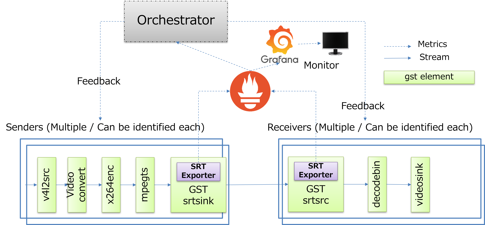
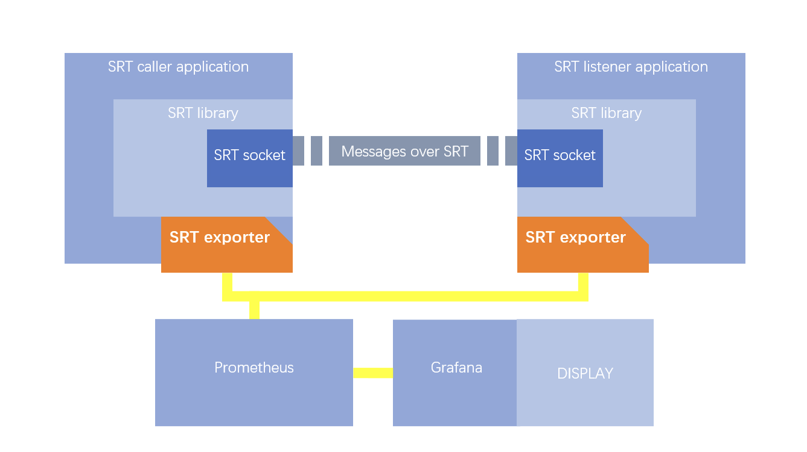

# Prometheus exporter for Nimble SRT

## Описание

### Введение

Prometheus exporter for Nimble SRT (далее — Prometheus exporter) предназначен для сбора метрик медиа-сервера Nimble Streamer, работающего по протоколу SRT, с  последующей их отправкой в мониторинговую систему Prometheus.

> **Примечание**
>
> [SRT (Secure Reliable Transport)](https://en.wikipedia.org/wiki/Secure_Reliable_Transport) — протокол передачи видео- и аудиоданных на основе UDP. Оптимизирован для передачи данных через Интернет с минимальной задержкой.

В состав Prometheus exporter входит комплект дашбордов Grafana для визуализации полученных метрик.

### Архитектура

Prometheus-сервер отправляет http-запрос для получения статистики в Prometheus exporter, который, в свою очередь, отправляет запрос в SRT statistic API.

Диаграмма использования:



Диаграмма взаимодействия:



### Режимы работы

Prometheus exporter может работать в одном из двух режимов:

- Режим периодического сбора метрик — сборщик статистических данных в Prometheus exporter собирает статистику в течение определенного периода и кеширует данные в памяти. При получении запроса все данные из кеша будут отправлены в Prometheus. Этот режим снижает нагрузку на Prometheus, а также снижает сетевой трафик между Prometheus exporter и Prometheus. Недостаток режима — необходимость выделения динамического объема памяти для кеширования данных.

- Пассивный режим -  за вызов SRT statictic API отвечает пользователькое приложение. Данные будут хранится в Prometheus exporter и отправлятся в Prometheus по запросу.

## Развертывание

Основной способ развертывания — в среде контейнеризаци (Docker, CRI-O, containerd и другие) с помощью оркестратора Kubernetes.

Для развертывания Prometheus exporter:

1. Добавьте в используемый манифест (например `service.yml`, `deployment.yml`, `pod.yml`) следующие строки:

    ```yml
    - name: srt-exporter
    image: {{ $.Values.werf.image.exporter }}
    command:
    - /nimble_exporter
    - -auth_salt=590
    - -auth_hash=xxxx
    ports:
    - containerPort: 9017
        name: exporter
        protocol: TCP
    resources:
        {{ toYaml $.Values.resources.exporter |  nindent 10 }}
    ```

    где:

    - `name` — имя контейнера;
    - `image` — образ Docker, содержащий приложение;
    - `command` — команды, которые выполняются при запуске контейнера;
    - `ports` — порты, которые будут открыты для внешних подключений;
    - `resources` — ресурсы, которые выделяются контейнеру.

2. Примените обновленный манифест командой:

    ```yml
    kubectl apply -f <filename>
    ```

    где `<filename\>` — имя обновленного файла-манифеста, например `deployment.yml`.

Для успешного развертывания также требуется настроить Prometheus и другие компоненты инфраструктуры мониторинга в соответствии с потребностями пользователя.
